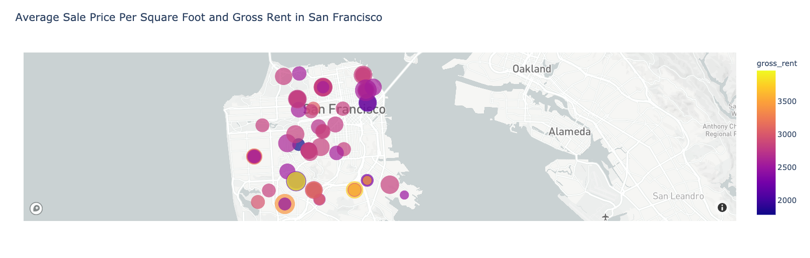

# San-Francisco-Housing-Rental-Analysis

Visualizing the average gross rent and sales price per square foot in the San Francisco area from the period of 2010 to 2016.

Initial analysis uses fairly simple bar and line plots to visualize the trend of the number of housing units available, sales price per square foot, gross rent.

Secondary analysis uses Mapbox API to create a map plot visualization of various San Francisco neighboorhoods. 

*    Note: The .env file was not uploaded for security reasons.
*    Users who will wish to test their own analysis must provide their own Mapbox token.

---

## Technologies

This application runs on python version 3.7, with the following add-ons:

* [PyViz](https://github.com/pyviz) - An open source visualizing software created for Python.

---

## Installation Guide

Before using the rental analysis, the following packages must be installed:

*    conda install -c plotly plotly=4.13.
*    conda install -c pyviz hvplot

---

## Example

For a visual reference of the housing data that was analyzed, please refer to the below images:

---

## Contributors

Santiago Rosas

